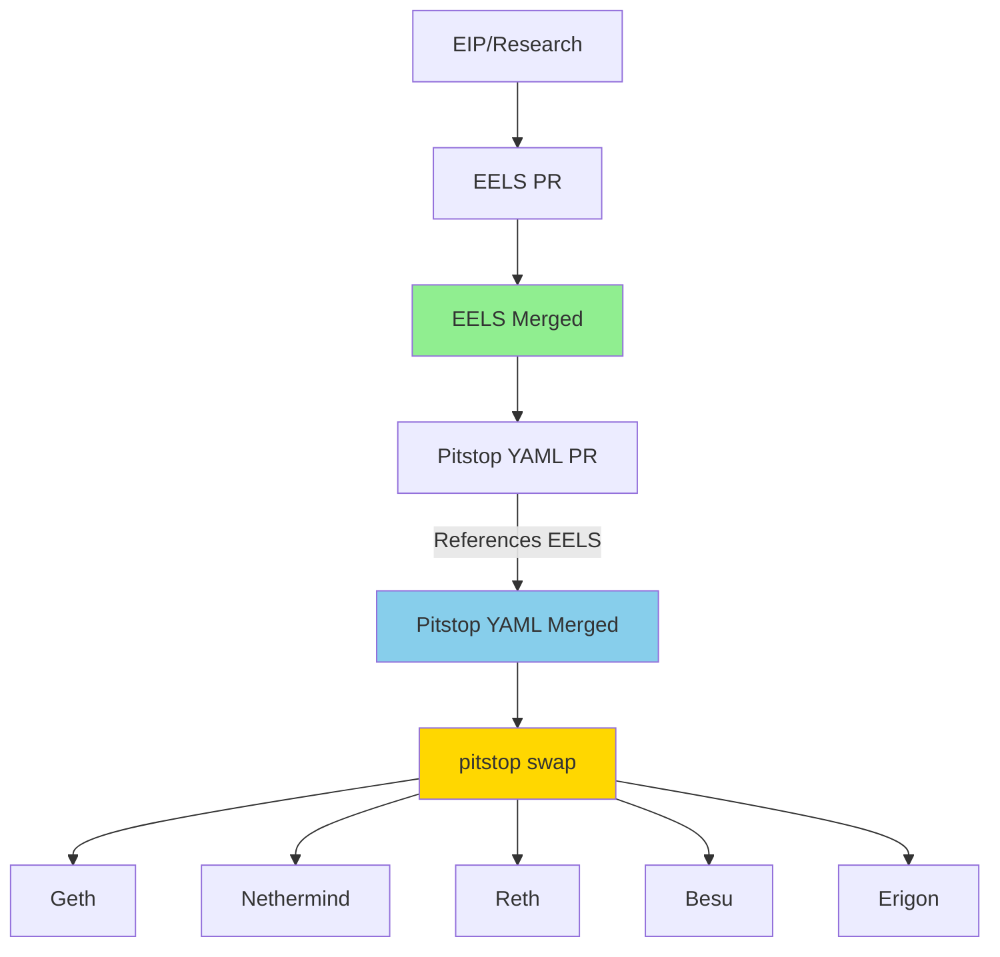

# Pitstop 🏁

<p align="center">
  
</p>

<h3 align="center">
  Swap Ethereum configs at racing speed; without the pit-crew!
</h3>

## Config as first class citizens

Client diversity makes Ethereum resilient. But it makes config changes hard.

When you need to update protocol parameters you have to edit 5+ clients in 4+ languages. It's tedious work. You copy values between files. You check each one carefully. But mistakes still slip through. A typo here, a wrong constant there. Now clients disagree and you're debugging consensus issues.


Besides this is hindrance for research velocity.

A better way would be to treat config like code. Write it once, generate everywhere.

Define your parameters in YAML. Version control them. Review changes like you would a spec. Then generate correct implementations for every client. No copying. No typos. No inconsistencies.

## Workflow

**🛡️ Safety:** EELS and Pitstop are updated independently through separate PRs. 
EELS PR must be merged before Pitstop YAML can be updated.
If Pitstop has a bug or someone updates the YAML incorrectly, it can be caught by comparing against EELS. 
This avoids a single point of failure where all clients get wrong values.



## Installation

Two steps to start using Pitstop:

1. **Install uv** ([docs](https://docs.astral.sh/uv/getting-started/installation/))

   ```bash
   curl -LsSf https://astral.sh/uv/install.sh | sh
   ```

2. **Run Pitstop**

   ```bash
   uvx --from git+https://github.com/raxhvl/pitstop pitstop swap geth prague output.go
   ```

That's it. No cloning, no setup.

## Usage

You want to test a new gas schedule. You write it once:

```yaml
# schedules/prague.yaml
storage:
  SSTORE_SET: 18000    # was 20000
```

Then generate the code for each client:

```bash
$ pitstop swap geth prague go-ethereum/core/vm/gas.go
🏁 Config updated!

$ pitstop swap nethermind prague Nethermind.Evm/GasCostOf.cs
🏁 Config updated!
```
