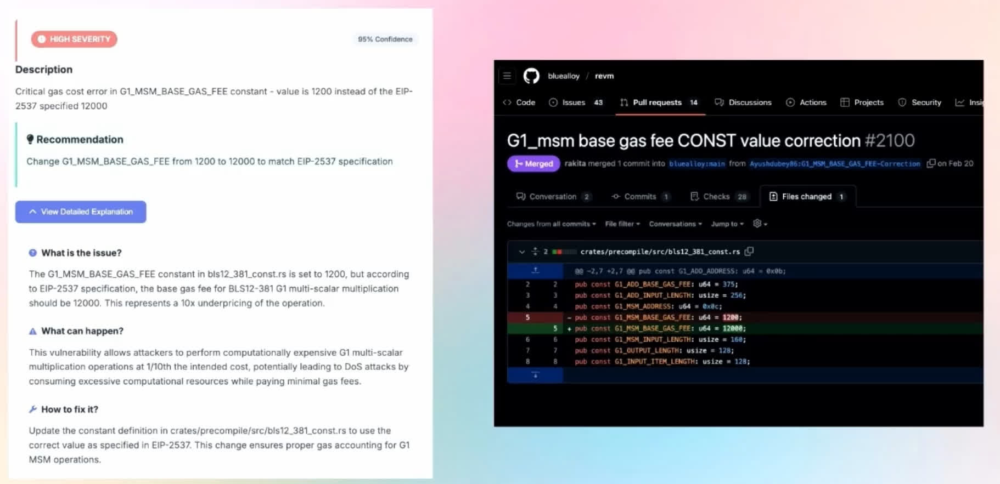
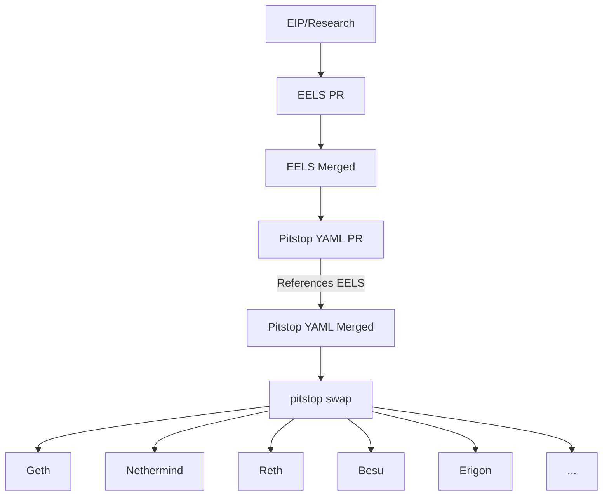

<p align="center">
  
</p>

<h3 align="center">
   Pitstop is a flexible, composable way to describe gas schedules across Ethereum forks. 
</h3>

## Config as first class citizens

Client diversity makes Ethereum resilient. But it makes config changes hard.

When you need to update protocol parameters you have to edit 5+ clients in 4+ languages. It's tedious work. You copy values between files. You check each one carefully. But mistakes still slip through. A typo here, a wrong constant there. Now clients disagree and you're debugging consensus issues.



Besides this is hindrance for research velocity.

A better way would be to treat config like code. Write it once, generate everywhere.

Define your parameters in YAML. Version control them. Review changes like you would a spec. Then generate correct implementations for every client. No copying. No typos. No inconsistencies.

## Workflow

**🛡️ Safety:** EELS and Pitstop are updated independently through separate PRs.
EELS PR must be merged before Pitstop YAML can be updated.
If Pitstop has a bug or someone updates the YAML incorrectly, it can be caught by comparing against EELS.
This avoids a single point of failure where all clients get wrong values.



## Installation

Two steps to start using Pitstop:

1. **Install uv** ([docs](https://docs.astral.sh/uv/getting-started/installation/))

   ```bash
   curl -LsSf https://astral.sh/uv/install.sh | sh
   ```

2. **Run Pitstop**

   ```bash
   uvx --from git+https://github.com/raxhvl/pitstop pitstop swap geth prague output.go
   ```

That's it. No cloning, no setup.

## Usage

You want to test a new gas schedule. You write it once:

```yaml
# schedules/prague.yaml
storage:
  SSTORE_SET: 18000    # was 20000
```

### Generate configs

Then generate the code for each client:

```bash
$ pitstop swap geth prague go-ethereum/core/vm/gas.go
🏁 Config updated!

$ pitstop swap nethermind prague Nethermind.Evm/GasCostOf.cs
🏁 Config updated!
```

### Pitstop in build system

Before releasing, verify the config matches your schedule:

```bash
$ pitstop check geth prague go-ethereum/core/vm/gas.go
✓ Config matches!
```

Integrate it into your build system to catch mismatches before compilation:

```bash
#!/bin/bash

# Step 1: Verify config
echo "Running Pitstop verification..."
pitstop check geth prague go-ethereum/core/vm/gas.go

# Step 2: Build only if verification passes
if [ $? -ne 0 ]; then
  echo "Pitstop verification failed! Aborting build."
  exit 1
fi

echo "Pitstop verification passed. Building go-ethereum..."
make --all go-ethereum/

echo "Build complete!"
```

### Compare schedules

Need to review what changed between forks? Compare schedules:

```bash
$ pitstop compare prague osaka
🔍 Comparing schedules...

operations:
  - BASE: 2 → 3

storage:
  - SSTORE_SET: 20000 → 18000

precompiles:
  + BLS12_G1ADD: 500
```

## Research Workflow

Prototype gas schedule changes without waiting for EIP formalization.

### Create an Experimental EIP

```bash
# Create a new EIP file
cat > schedules/eips/research.cheap_sload.yaml <<EOF
name: "Experiment: Reduce SLOAD cost to 100"

categories:
  operations:
    SLOAD: 100
EOF
```

### Define a Research Fork

Edit `schedules/forks.yaml` and add:

```yaml
prague_cheap_sload:
  extends: prague
  eips: ["research.cheap_sload"]
```

### Generate and Test

```bash
# Generate client code
pitstop swap geth prague_cheap_sload output.go

# Compare with base fork
pitstop compare prague prague_cheap_sload

# Output shows:
# Comparing prague vs prague_cheap_sload
#
# Operations:
#   SLOAD: 800 → 100
#
# ✓ 1 changed
```

### Iterate Quickly

```bash
# Edit schedules/eips/research.cheap_sload.yaml
# Change SLOAD to 150

# Regenerate immediately
pitstop swap geth prague_cheap_sload output.go

# Test in your client
cd go-ethereum && make all && ./build/bin/geth --dev
```

This workflow lets you test ideas in hours instead of weeks.

## How It Works

Pitstop uses an EIP-centric, composable architecture where:
- Each EIP is a separate YAML file with gas cost changes
- Forks are defined as ordered lists of EIPs with inheritance
- Templates generate client-specific code from resolved schedules

For detailed technical design and adding new schedules, see [docs/design.md](docs/design.md).
